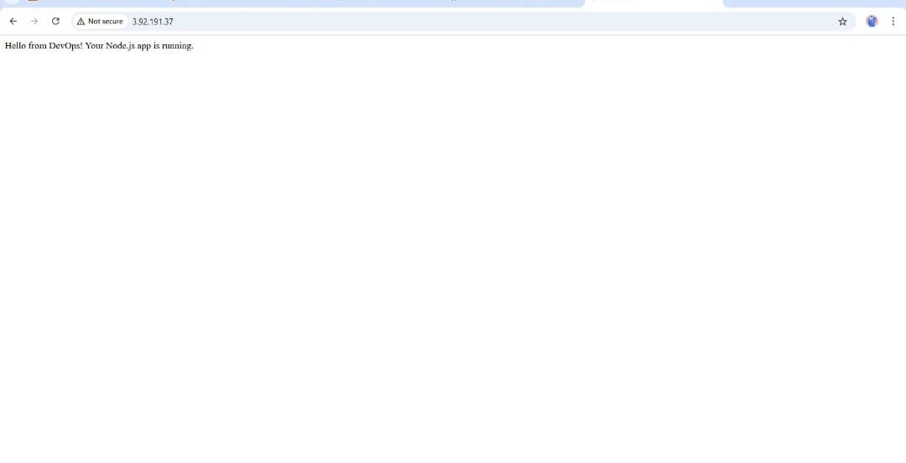

# 🚀 Hello DevOps App: CI/CD Pipeline

This repository contains a simple Node.js application and a robust Continuous Integration/Continuous Delivery (CI/CD) pipeline built using GitHub Actions to deploy the application to an AWS EC2 instance via Amazon Elastic Container Registry (ECR).

---

## 📸 Final Output (Live App View)

  
> “Hello from DevOps! Your Node.js app is running.”

---

## 🔧 Project Description

The hello-devops-app is a basic Node.js web server that serves a "Hello from DevOps!" message. The core purpose of this project is to demonstrate an automated deployment workflow:  
Any code changes pushed to the main branch will automatically trigger a build, containerization, image push to ECR, and deployment to a running EC2 instance.

---

## ✅ Features

- Node.js Application – Simple web server  
- Dockerized App – Containerized with Docker  
- CI/CD via GitHub Actions  
- Amazon ECR Integration – Stores Docker images  
- AWS EC2 Deployment – Runs containers on EC2  
- Fully Automated – Triggered by code push

---

## 🧰 Technologies Used

- Node.js  
- Docker  
- GitHub Actions  
- AWS EC2  
- AWS ECR  
- AWS IAM  
- SSH  

---

## 🖼 EC2 Instance Running on AWS


---

## 🐳 Docker Container Status


---

## 🧠 Architecture Overview

```mermaid
graph TD
    A[Developer Push Code] --> B(GitHub Repository)
    B -- Trigger --> C(GitHub Actions Workflow)
    C -- Build Docker Image --> D(Docker Image)
    D -- Push to ECR --> E(AWS ECR)
    C -- SSH Connect (via SSH_PRIVATE_KEY) --> F(AWS EC2 Instance)
    E -- Pull Image --> F
    F -- Run Docker Container --> G(Node.js App Running)
    G -- Accessible via Port 80 --> H[User Browser]


---

🚀 Setup and Deployment

✅ Prerequisites

AWS Account

GitHub Account

AWS CLI & Docker installed

EC2 Key Pair (.pem)

Git


---

⚙ 1. AWS Setup

a. EC2 Instance

Launch EC2 (e.g. t2.micro, Amazon Linux 2)

Security Group Inbound Rules:

SSH (22) – 0.0.0.0/0

HTTP (80) – 0.0.0.0/0

TCP (3000) – 0.0.0.0/0


b. ECR Repository

AWS Console → ECR → Create Repository

Note down the repo URI


c. IAM Role for EC2

Create role with:

AmazonEC2ContainerRegistryReadOnly

(Optional: CloudWatchLogsFullAccess)


Attach role to EC2 instance


---

📁 2. GitHub Repository Setup

a. Fork or clone this repository

b. Generate SSH Key (from local machine)

ssh-keygen -t rsa -b 4096 -f ~/.ssh/github_actions_id_rsa -N ""

Copy public key:

cat ~/.ssh/github_actions_id_rsa.pub

Add to EC2 instance:

mkdir -p ~/.ssh
chmod 700 ~/.ssh
echo "PASTE_YOUR_PUBLIC_KEY_HERE" >> ~/.ssh/authorized_keys
chmod 600 ~/.ssh/authorized_keys

c. Add GitHub Secrets

AWS_ACCESS_KEY_ID

AWS_SECRET_ACCESS_KEY

SSH_PRIVATE_KEY


d. Update GitHub Actions Workflow (main.yml)

Set:

ECR_REGISTRY

ECR_REPOSITORY

AWS_REGION

EC2_INSTANCE_IP

SSH_USER


Ensure deployment block uses correct YAML syntax.


---

🔄 3. Deployment Workflow

On every push to main:

1. GitHub Actions builds & pushes Docker image to ECR


2. Connects to EC2


3. Logs in to ECR


4. Pulls latest image


5. Stops old container


6. Runs new container


---

🌐 Usage

Visit your EC2 Public IP in a browser:
http://3.92.191.37

You should see:
"Hello from DevOps! Your Node.js app is running."


---

🛠 Troubleshooting

Issue	Possible Fix

i/o timeout	Update EC2 IP & ensure Port 22 open
SSH Auth failure	Recheck SSH_PRIVATE_KEY and EC2 authorized_keys
Docker auth fail	Attach correct IAM Role to EC2
Workflow is green but site unreachable	App crashed – check docker logs
YAML error	Check indentation (use 2 spaces consistently)


---

🙌 Author

Ejike Gloria
AWS Certified Solutions Architect | DevOps Enthusiast
GitHub | LinkedIn

---
